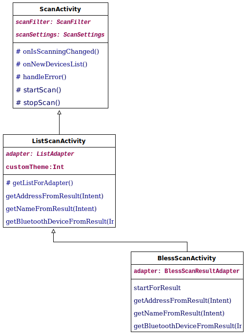
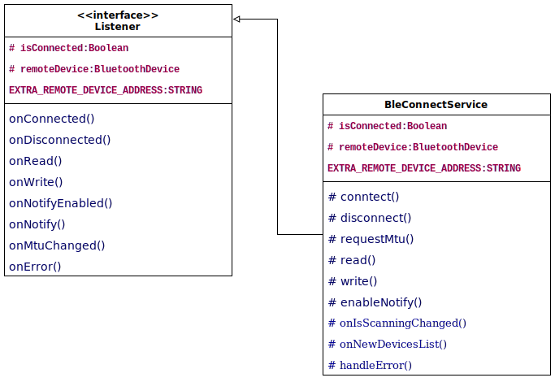
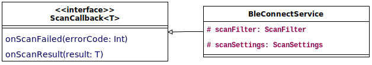

# BLEss UI
BLEss UI is a set of commonly used Android UI Components.

# Setup

### Dependencies
Apply the [setup](../setup.md) from bless-core, then add this module:
```gradle
// BLEss core features
implementation "com.troido.bless:bless-ui:$bless_version"
```

# Basic information
In the bless-ui module we have 3 different levels of activity abstraction and 2 abstract services.
The most abstract activity is `ScanActivity`. It has basic methods like `startScan()` and `stopScan()` as well as abstract method-callbacks (`onIsScanningChanged()`,`onNewDevicesList()`,`handleError()`).

Then comes `ListScanActivity`. This activity requires a `ListAdapter`, it has embedded listView which displays scanned devices through this adapter. Selected ble device will be returned in `onActivityResult()` method of a caller activity or in the `onDeviceSelected()` method of the instance if it overrides it.

Finally, `BlessScanActivity` is a ready to go activity that provides its own `ListAdapter` and returns a selected ble device to the `onActivityResult()` method of a caller activity

Below you can see UML class diagram that represents the dependencies between these three classes.


Additional info for the picture:</br>
*italic text* - abstract classes, fields, methods</br>
normal text - normal classes, fields, methods</br>
<ins>underline text</ins> - static fields, methods </br>
\# - protected fields and methods

Other part of the bless-ui is the abstract `BleConnectService`, It has basic methods to `connect`, `disconnetc`, `requestMtu`, etc. and abstract callback methods that will be invoked in an instance of this service. Uml class diagram is presented below.


Additional info for the picture:</br>
*italic text* - abstract classes, fields, methods</br>
normal text - normal classes, fields, methods</br>
<ins>underline text</ins> - static fields, methods </br>
\# - protected fields and methods

Another abstract service is `BleScanService`. We can start and stop scan by running/stopping the service that derives from it.
Uml class diagram is presented below.


Additional info for the picture:</br>
*italic text* - abstract classes, fields, methods</br>
normal text - normal classes, fields, methods</br>
<ins>underline text</ins> - static fields, methods </br>
\# - protected fields and methods

# Usage

## BlessScanActivity
`BlessScanActivity` is the simplest way to let the user select a nearby ble device.
it uses `ActivityResultContracts`.
```kotlin
requestBluetoothScanning.launch(BlessScanActivity.getIntent(this))
```

Retrieve the result inside your contract in your Activity or Fragment:
```kotlin
private val requestBluetoothScanning =
    registerForActivityResult(ActivityResultContracts.StartActivityForResult()) {
        when (it.resultCode) {
            RESULT_ABORT -> showToast("User Aborted Scanning")
            RESULT_SUCCESS -> {
                val macAddress = BlessScanActivity.getAddressFromResult(it.data)
                showToast("Retrieved Mac: $macAddress")
            }
            RESULT_SCANNING_ERROR -> showToast("Error In Scanning")
        }
    }
```

The result is defined in the base class `ListScanActivity`:
- `RESULT_SCANNING_ERROR` is called on scan errors. That can happen when the limit of start-scan requests per time was reached (usually 5 times per 30 seconds since Android 7).
- When Bluetooth is disabled a dialog is shown. `RESULT_ABORT` is returned when the user denys to enable bluetooth.
- `RESULT_ABORT` is returned when the back- or upbutton was pressed or location permission was permanently denied, too.
- `RESULT_SUCCESS` is returned when the the user chooses a device. The data has the device address.

By default `BlessScanActivity` uses an own theme.
You can use your theme by adding the parameter to `startForResult`.
The theme should have an action bar.
You can customize scanning by adding `ScanSettings` or a `ScanFilter`

The result looks like that


## ListScanActivity

You can create an own implementation of `ListScanActivity` to customize it.
It has a ProgressBar on top and a RecyclerView below.
The ProgressBar shows if the phone is scanning.
When the user selects a device, `onDeviceSelected(address: String, name: String?)` should be called.
By implementing a ListAdapter you can change the way the scanned devices are visualized.

1) Create a view for the listItems.

```xml
<?xml version="1.0" encoding="utf-8"?>
<androidx.constraintlayout.widget.ConstraintLayout xmlns:android="http://schemas.android.com/apk/res/android"
    xmlns:app="http://schemas.android.com/apk/res-auto"
    xmlns:tools="http://schemas.android.com/tools"
    android:layout_width="match_parent"
    android:layout_height="wrap_content"
    android:background="?attr/selectableItemBackground"
    android:clickable="true"
    android:focusable="true">

    <ImageView
        android:id="@+id/image"
        android:layout_width="wrap_content"
        android:layout_height="wrap_content"
        android:padding="24dp"
        android:src="@drawable/ic_baseline_bluetooth_24"
        app:layout_constraintBottom_toBottomOf="parent"
        app:layout_constraintStart_toStartOf="parent"
        app:layout_constraintTop_toTopOf="parent" />

    <TextView
        android:id="@+id/name"
        android:layout_width="0dp"
        android:layout_height="wrap_content"
        app:layout_constraintBottom_toBottomOf="parent"
        app:layout_constraintEnd_toEndOf="parent"
        app:layout_constraintStart_toEndOf="@id/image"
        app:layout_constraintTop_toTopOf="parent"
        tools:text="Hello" />

</androidx.constraintlayout.widget.ConstraintLayout>
```

2) Create a ViewHolder that references the used views.

```kotlin
class CustomViewHolder(itemView: View) : RecyclerView.ViewHolder(itemView) {
    val nameView: TextView = itemView.name
}
```

3) Create a ListAdapter that puts the ScanResults into the RecyclerView.

```kotlin
class CustomAdapter(private val deviceSelectedCallback: DeviceSelectedCallback) :
    ListAdapter<ScanResult, CustomViewHolder>(CustomItemCallback()) {

    override fun onCreateViewHolder(parent: ViewGroup, viewType: Int): CustomViewHolder {
        val view =
            LayoutInflater.from(parent.context).inflate(R.layout.custom_view_holder, parent, false)
        return CustomViewHolder(view)
    }

    override fun onBindViewHolder(holder: CustomViewHolder, position: Int) {
        val scanResult = getItem(position)
        holder.nameView.text = scanResult.device.name
        // This is the ConstraintLayout. We have set it to clickable and focusable.
        // The background attribute will give us the clicking animation.
        holder.itemView.setOnClickListener { deviceSelectedCallback.onDeviceSelected(scanResult.device.address) }
    }

    class CustomItemCallback : DiffUtil.ItemCallback<ScanResult>() {
        override fun areItemsTheSame(oldItem: ScanResult, newItem: ScanResult): Boolean {
            // The Bluetooth Device Address is unique so we can use it as an ID
            return oldItem.device.address == newItem.device.address
        }

        override fun areContentsTheSame(oldItem: ScanResult, newItem: ScanResult): Boolean {
            // Since the ListItem only shows the name we are only interested in updates on the name.
            return oldItem.device.name == newItem.device.name
        }
    }
}
```

4) Create a custom activity that extends `ListScanActivity`.

```kotlin
class CustomScanningActivity : ListScanActivity<ScanResult>() {
    override val adapter = CustomAdapter(this::onDeviceSelected)

    // As an example, we only show devices, that advertise a name.
    override fun getListForAdapter(deviceList: List<ScanResult>) =
        deviceList.filter { it.device.name != null }

    override val scanFilter = ScanFilter.empty()
    override val scanSettings = ScanSettings.default()
}
```

The result looks like that


With `getListForAdapter(deviceList: List<T>)` you can change the list before it gets passed to the adapter.
If the whole List should just be forwarded you can return `deviceList`.
But you can also put your own logic to filter the list by your own needs or even merge it with your own data by mapping it. The generic type will help you to pass your own objects to the adapter.

## ScanActivity

If you need even more flexibility you can extend `ScanActivity`.
`startScan()` will start scanning if all conditions are met.
It will make sure that the bluetooth adapter is enabled and the permissions are granted.
If the user does finally deny that `handleError(true)` will be called.
If there is a technical issue `handleError(false)` will be called.
The scanning state can be observed with `onIsScanningChanged(boolean)`.
The list of scanned devices is provided in `onNewDevicesList(List<ScanResult>)`.
The cache of scanned devices can be cleared with `clearScanResults()`.
`stopScan()` will stop the scanning process.

Here is an activity that just counts the scanned devices.

```xml
<?xml version="1.0" encoding="utf-8"?>
<TextView xmlns:android="http://schemas.android.com/apk/res/android"
    xmlns:tools="http://schemas.android.com/tools"
    android:id="@+id/count"
    android:layout_width="match_parent"
    android:layout_height="match_parent"
    android:gravity="center"
    android:textSize="50sp"
    tools:text="0\ndevices" />
```

```kotlin
class CounterActivity : ScanActivity() {
    override val scanFilter = ScanFilter.empty()
    override val scanSettings = ScanSettings.default()

    override fun onIsScanningChanged(isScanning: Boolean) {
        Toast
            .makeText(this, "Scanning changed to: $isScanning", Toast.LENGTH_SHORT)
            .show()
    }

    override fun onNewDevicesList(newDevicesList: List<ScanResult>) {
        count.text = "${newDevicesList.size}\ndevices"
    }

    override fun handleError(isUserDecision: Boolean) {
        Toast
            .makeText(this, "Scan Error. By User: $isUserDecision", Toast.LENGTH_LONG)
            .show()
    }

    override fun onCreate(savedInstanceState: Bundle?) {
        super.onCreate(savedInstanceState)
        setContentView(R.layout.activity_device_counter)
    }

    override fun onResume() {
        super.onResume()
        startScan()
    }

    override fun onPause() {
        super.onPause()
        stopScan()
    }
}
```

The result looks like that


## BleConnectService

Bless-ui module provides the abstract `BleConnectService`. This service starts on devices and connects to the device whose address passed in an intent with `EXTRA_REMOTE_DEVICE_ADDRESS` key. User can stop this service directly with a stop button on a notification. It also has plenty of methods that give an opportunity to implement desired behaviour (you can see them on the UML class diagram above)

Example of starting service static method:
```kotlin
class CustomBleConnectService : BleConnectService()

....

  companion object {

      fun startService(context: Context, address: String) {
          val intent = Intent(context, CustomBleConnectService::class.java)
          intent.putExtra(EXTRA_REMOTE_DEVICE_ADDRESS, address)
          if (Build.VERSION.SDK_INT >= Build.VERSION_CODES.O) {
              context.startForegroundService(intent)
          } else {
              context.startService(intent)
          }
      }
  }
```

## BleScanService

Bless-ui module provides the abstract `BleScanService`. This service starts on devices and begins scanning. User can stop this service directly with a stop button on a notification. Service stops scanning whenever it is stopped.

Example of starting service static method:
```kotlin
class ScanService : BleScanService() {

    override val scanSettings: ScanSettings =
        ScanSettings.Builder().scanMode(ScanMode.LOW_LATENCY).build()

    override val scanFilter: ScanFilter = super.scanFilter

    override fun onScanFailed(errorCode: Int) {
        Timber.d("Scan failed, errorCode: $errorCode")
        stopSelf()
    }

    override fun onScanResult(result: ScanResult) {
        Timber.d("Scan result, result: $result")
    }
}

ScanServieActivity.kt
...
binding.startServiceButton.setOnClickListener {
    Timber.d("Start service button clicked")
    if (android.os.Build.VERSION.SDK_INT >= android.os.Build.VERSION_CODES.O) {
        startForegroundService(Intent(this, ScanService::class.java))
    } else {
        startService(Intent(this, ScanService::class.java))
    }
}
...
```
